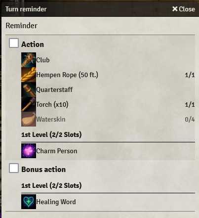
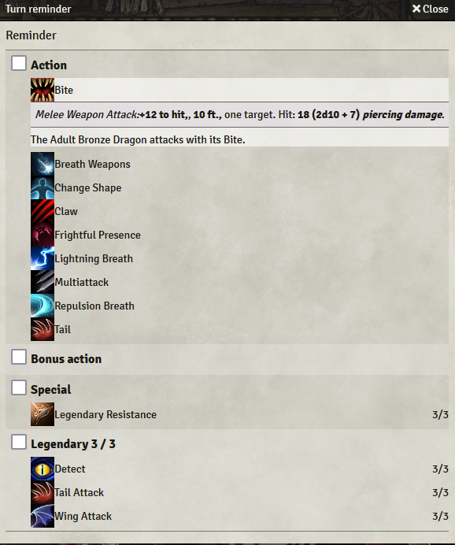

# Foundry VTT Turn Reminder
A simple handy dandy module that will activate during combat and show you what you can do on your turn, including the DM.

When your turn starts, you will receive this popup. The module will attempt to find all actions that are relevant during combat and show them as options.

It is also useful for DMs as you don't need to switch to multiple monster sheets.

## Shoutout
This module is inspired by [DnD5 Cheatsheet](https://github.com/pchouzenoux/foundryvtt-dnd5-cheatsheet) and [Character Actions 5e](https://github.com/ElfFriend-DnD/foundryvtt-dnd5eCharacterActions)